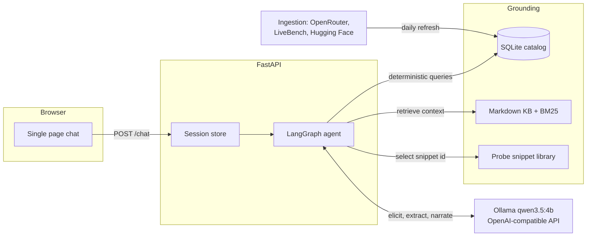

# Which Model?

A chat-first web app that helps a non-expert find the right LLM for their task, budget, and hardware. You describe what you want in plain language ("I want a chatbot for my shop", "something that codes for me offline"); the agent asks a couple of smart questions, checks a real model catalog, and hands you a grounded recommendation with a comparison table and cost estimates, in dollars and rupees.

Existing tools (quiz sites, wizard forms, CLI pickers) make you fill out a form. This is a conversation that translates a vague task description into structured requirements for someone who does not know what a context window is.

## The 60-second demo

1. Open the app. Type: "offline chatbot on my MacBook, fully private".
2. The agent asks nothing you cannot answer, shows what it is doing while it thinks (reading its knowledge base, querying the catalog, searching the web), and never repeats a question. A "Recommend now" button skips the rest of the questions whenever you are done explaining.
3. When your hardware matters, it hands you one safe, pre-written terminal command: "run this and paste the output". It detects your RAM and chip, filters the catalog to models that actually fit, and renders a card: top pick, runner-up, budget pick, how to run each one (cloud signup or `ollama pull`), a comparison table with an explained score, monthly cost with the estimation basis spelled out, and the assumptions it made.
4. Every model name, price, and score traces to a row in a local SQLite catalog refreshed daily from OpenRouter and LiveBench. Ask about a model it does not carry and it says so, backed by a quick sourced web search, instead of guessing. The brain is a small local model (Qwen3.5 4B via Ollama); it is never trusted to recall facts.

## Quickstart

Requirements: Python 3.11+, [uv](https://docs.astral.sh/uv/), [Ollama](https://ollama.com).

```bash
git clone <this-repo> && cd which-model
ollama pull qwen3.5:4b          # the default serving model (~3GB)
ollama pull nomic-embed-text    # optional: enables hybrid retrieval (~270MB)
uv sync
make dev                        # http://127.0.0.1:8000
```

The repo ships with a pre-built `data/models.db`, so the app works immediately. Refresh it any time with `make refresh-data`.

Swapping the serving model or backend is a `.env` change only (copy `.env.example` to `.env` and edit). Any OpenAI-compatible endpoint works: Ollama, LM Studio, llama.cpp server, vLLM, or a cloud API.

## Architecture



The agent graph: a deterministic router classifies each turn (new info, pasted probe output, "just recommend already"), an extraction node updates a typed requirements object, a retrieval node pulls curated knowledge-base docs, and the recommend node composes the final answer strictly from catalog rows, with post-generation validation that rejects any model name not in the candidate list. Full detail in [docs/SYSTEM_DESIGN.md](docs/SYSTEM_DESIGN.md).

## Project structure

```
whichmodel/          the app package
  agent/             LangGraph graph, nodes, LLM client, grounding validation
  retrieval/         Retriever protocol, BM25 implementation, KB loader
  tools/             deterministic catalog queries, hardware probes, cost estimator
  web/               FastAPI app + static frontend (no build step)
  sessions.py        session store behind an interface
kb/                  curated markdown knowledge base (the 4B model's brain food)
ingestion/           catalog refresh: OpenRouter, LiveBench, Hugging Face
evals/               scenario harness, the regression gate for model swaps
data/                seed models.db + hardware probe snippet library
docs/                system design, deployment, runbook, KB style guide
tests/               unit + graph tests, all runnable without a live model
```

## Commands

| Command | What it does |
|---|---|
| `make dev` | Run the app at http://127.0.0.1:8000 |
| `make test` | Unit and graph tests (no model needed) |
| `make eval` | 15 scripted scenarios against the live model |
| `EVAL_MOCK=1 make eval` | Same harness with a heuristic mock (plumbing check) |
| `make refresh-data` | Refresh the catalog from live sources |
| `make seed` | Rebuild the catalog from bundled snapshots, offline |
| `make lint` | Ruff check + format check |

## FAQ

**Why does it ask me to run a terminal command?**
To learn your RAM and GPU so local recommendations actually fit. Commands come from a fixed, read-only library in `data/hardware_snippets.yaml`; the AI never writes them. You can also just type "16GB MacBook" instead.

**Why a tiny 4B model instead of calling a frontier API?**
The product recommends models, so it should not depend on one. The small model only elicits, routes, and narrates. Facts come from SQLite and the knowledge base, and a validation step rejects anything it invents. Swap in a bigger model with one line in `.env` if you like, then run `make eval` to confirm nothing regressed.

**How fresh is the data?**
The footer shows the catalog age. A GitHub Actions workflow (or local cron, see [docs/DEPLOYMENT.md](docs/DEPLOYMENT.md)) refreshes daily from the OpenRouter models API and LiveBench release CSVs. The app never calls external APIs during a conversation.

**A model I know is missing.**
If it is not in the DB, it does not exist for this app, by design. See [docs/RUNBOOK.md](docs/RUNBOOK.md) for adding models and name aliases.

**How does retrieval work?**
Hybrid: BM25 keyword search plus local embeddings (nomic-embed-text via Ollama), fused by reciprocal rank. No vector database, no external service; document vectors cache on disk. If the embedding model is not pulled, it silently runs BM25 alone. See [docs/SYSTEM_DESIGN.md](docs/SYSTEM_DESIGN.md).

**Does it search the web?**
Only when needed: if you ask about a model that is not in its catalog, it runs a DuckDuckGo search, tells you what it found with the source URL, and shows the search in the activity feed. Recommendations still come exclusively from the catalog. Set `WEB_SEARCH=off` to disable.
