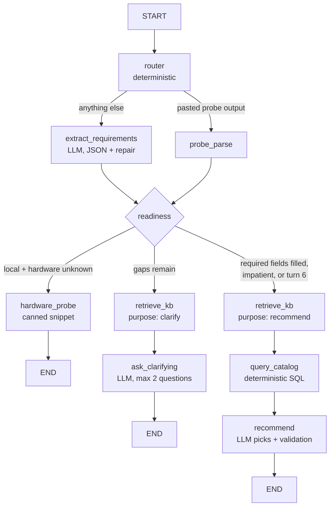

# System Design

## The core bet

A 4B local model is useful if, and only if, it is never trusted with facts. The design splits responsibilities hard:

- The LLM elicits, routes, and narrates.
- SQLite answers "which models, what price, what score".
- A curated markdown knowledge base answers "what does this benchmark mean, what fits in 32k tokens".
- A validation layer rejects LLM output that names models outside the grounded candidate set.

If the LLM disappeared tomorrow, the tools would still produce a correct (if robotic) recommendation. That fallback actually exists and ships: every LLM-dependent node has a deterministic degraded path.

## Graph

One graph invocation handles one user turn and ends. The web layer persists the returned state per session and re-invokes on the next message. No human-in-the-loop interrupts exist inside the graph.

## State schema

`AgentState` (pydantic): `messages` (rolling window), `summary` (compact string for older turns), `requirements` (the typed extraction below), `kb_context` (chunks retrieved this turn), `candidates` (catalog rows), `phase` (eliciting, probing_hardware, retrieving, recommending, done), `user_turns`, `recommend_now`, `pending_probe`, and per-turn outputs (`reply`, `recommendation`, `notices`).

`Requirements`: task_category (10-value enum), task_description, deployment (local/api/either), budget_monthly_usd, hardware (ram_gb, gpu, vram_gb, os), context_need (short/medium/long), latency_need, privacy_need, language_needs, usage_level, open_questions. `missing_required()` derives what must still be asked: task and deployment always; budget only for API deployment; hardware only for local.

## Node responsibilities and failure policy

| Node | LLM? | On LLM failure |
|---|---|---|
| router | no | n/a, pure rules (probe detection, impatience regex) |
| extract_requirements | yes, JSON schema | one repair re-prompt with the error, then continue with unchanged requirements |
| retrieve_kb | no | n/a, deterministic doc selection + BM25, capped at 2 rounds |
| ask_clarifying | yes | canned per-gap questions from a fixed table |
| hardware_probe | no | n/a, snippet library only; second attempt asks the user directly |
| query_catalog | no | n/a; empty result relaxes budget once, then reports honestly |
| recommend | yes | grounding-validated retry, then fully deterministic plan from rankings |

The structured-output wrapper (`agent/llm.py`) validates JSON against the pydantic schema, re-prompts once with the validation error, and raises after the second failure so each node can take its fallback. A conversation never crashes because a tool or the model failed; the web layer catches everything else and answers with a data-age disclosure.

## Why deterministic tools instead of RAG for facts

Facts here are relational: filter by price, join scores, compare context windows, check memory fit. SQL does this exactly; retrieval-augmented generation does it probabilistically and invites the model to blend half-remembered numbers with retrieved ones. The rule "if it is not in the DB, it does not exist" is also what makes the adversarial case tractable: when a user asks about SuperGPT-9000, `lookup_model` returns nothing and the agent says so instead of confabulating.

The knowledge base is the complement: distilled judgment (what a benchmark means, what 32k tokens holds) that has no schema. That is retrieval's job, and only that.

## Grounding enforcement

The recommend LLM receives a fixed candidate list and returns only ids plus short "why" strings. Assembly is deterministic: prices, INR conversion, score columns, and the comparison table come from `ModelRow` objects, never from generated text. Post-generation, `grounding.foreign_model_mentions()` scans all free text for surface forms of every catalog model (name, id, slug tail) and flags any mention outside the candidate set, with span logic so "GPT-5.4" inside "GPT-5.4-mini" does not false-positive. One violation triggers a corrective retry; a second one discards the LLM plan entirely for the deterministic fallback. The eval harness asserts zero violations across all scenarios.

## Why BM25 before embeddings

The corpus is 21 hand-written docs with controlled vocabulary and tags. BM25 with tag boosting resolves every routing test we have, runs in-process with zero services, and is debuggable by reading term scores. Embeddings add an inference dependency, an index lifecycle, and non-determinism, for no measurable gain at this corpus size. The `Retriever` protocol (`search`, `get`) is the seam: an embedding implementation drops in without touching graph code when the corpus outgrows keywords.

## Context budget strategy for small models

The serving model may have 8-16k usable tokens. Discipline applied:

- System prompts are templates under ~350 tokens each; the largest (recommend) stays under ~1,200 with candidates and KB inlined.
- The compact `requirements` object is the durable memory; the model window carries only the last 6 messages.
- Older messages fold into a 2-3 sentence LLM summary (best effort; requirements hold the facts regardless).
- KB docs are injected per turn, trimmed to 1,500 chars each, at most 4 docs, selected deterministically for the turn's purpose.
- Each turn makes 1-2 LLM calls (extract + either clarify or recommend), keeping latency tolerable on a laptop.

## Sessions

Cookie-keyed server-side store behind a `SessionStore` protocol; v1 is an in-memory dict with TTL. Page refresh resumes the session; "Start over" deletes it. Persistent per-user memory is a future implementation of the same protocol, not a redesign.

## Freshness pipeline

`ingestion/` refreshes SQLite from three sources, each independently fallible (partial refresh with warnings): OpenRouter models API (pricing, context, modalities), LiveBench release CSVs (per-category scores aggregated to `livebench_*` benchmarks, run variants collapsed to best-of), and the Hugging Face API (param counts for a curated local-model list, with hardcoded fallbacks). Cross-source name matching uses a normalizer plus an explicit alias seed; unmatched names are logged and skipped, never guessed. Snapshots of every fetch are committed, so `--offline` rebuilds the seed DB deterministically. All HTTP uses exponential backoff with jitter, max 3 retries, transient-only; 404s and schema changes fail fast. The app reads the local DB only and surfaces `last_refresh` age in the UI.

## Extension points

- **New model backend**: change `OPENAI_BASE_URL` and `MODEL_NAME` in `.env`, run `make eval`. Nothing else.
- **Embedding retriever**: implement `Retriever` over the same KB, swap in `web/app.py`.
- **New data source**: add a module in `ingestion/` following the openrouter/livebench pattern (fetch, snapshot, upsert, meta timestamp) and register it in `refresh.py`.
- **New benchmark for ranking**: ingest rows into `benchmarks`, map it in `catalog.CATEGORY_BENCHMARKS`, add a KB explainer doc.
- **Persistent sessions**: implement `SessionStore` over SQLite; the web layer stays unchanged.
- **SSE streaming**: v1 uses plain request/response because each turn is 1-2 short internal LLM calls, not one long generation; a streaming variant would wrap the final narration only.
